# Blog Post Workflow Diagram

This document provides visual workflows for creating and managing blog posts in the AIResumeGen project.

## 📋 Table of Contents

1. [Quick Start Workflow](#quick-start-workflow)
2. [Detailed Creation Process](#detailed-creation-process)
3. [File Relationships](#file-relationships)
4. [Decision Tree](#decision-tree)
5. [Documentation Flow](#documentation-flow)

---

## Quick Start Workflow

```mermaid
flowchart TD
    Start([New Blog Post Request]) --> Gather[Gather Requirements]
    Gather --> |Title, Content, Slug| CreateDir[Create Directory<br/>app/blog/your-slug/]
    CreateDir --> CopyCSS[Copy page.module.css<br/>from existing post]
    CopyCSS --> CreatePage[Create page.tsx<br/>from template]
    CreatePage --> UpdateList[Update Blog Listing<br/>app/blog/page.tsx]
    UpdateList --> UpdateSite[Update Sitemap<br/>app/sitemap.ts]
    UpdateSite --> Test[Run Diagnostics]
    Test --> |Pass| Done([✅ Complete])
    Test --> |Fail| Fix[Fix Errors]
    Fix --> Test
    
    style Start fill:#e1f5ff
    style Done fill:#d4edda
    style Test fill:#fff3cd
    style Fix fill:#f8d7da
```



---

## Detailed Creation Process


---

## File Relationships


---

## Decision Tree


---

## Documentation Flow


---

## Component Structure


---

## Update Checklist Flow

```mermaid
flowchart TD
    Start([Start Blog Post]) --> Step1{Create Directory?}
    Step1 -->|✅ Yes| Step2{Copy CSS?}
    Step1 -->|❌ No| Fix1[Create app/blog/slug/]
    Fix1 --> Step2
    
    Step2 -->|✅ Yes| Step3{Create page.tsx?}
    Step2 -->|❌ No| Fix2[Copy from existing post]
    Fix2 --> Step3
    
    Step3 -->|✅ Yes| Step4{SEO Metadata?}
    Step3 -->|❌ No| Fix3[Use template structure]
    Fix3 --> Step4
    
    Step4 -->|✅ Yes| Step5{Breadcrumbs?}
    Step4 -->|❌ No| Fix4[Add buildPageMetadata]
    Fix4 --> Step5
    
    Step5 -->|✅ Yes| Step6{Article Schema?}
    Step5 -->|❌ No| Fix5[Add breadcrumbs array]
    Fix5 --> Step6
    
    Step6 -->|✅ Yes| Step7{Content Sections?}
    Step6 -->|❌ No| Fix6[Add article object]
    Fix6 --> Step7
    
    Step7 -->|✅ Yes| Step8{ContentAd placed?}
    Step7 -->|❌ No| Fix7[Add sections with styles]
    Fix7 --> Step8
    
    Step8 -->|✅ Yes| Step9{Key Takeaways?}
    Step8 -->|❌ No| Fix8[Add after intro]
    Fix8 --> Step9
    
    Step9 -->|✅ Yes| Step10{CTA Section?}
    Step9 -->|❌ No| Fix9[Add styled section]
    Fix9 --> Step10
    
    Step10 -->|✅ Yes| Step11{Updated Listing?}
    Step10 -->|❌ No| Fix10[Add CTA with link]
    Fix10 --> Step11
    
    Step11 -->|✅ Yes| Step12{Updated Sitemap?}
    Step11 -->|❌ No| Fix11[Add card to blog/page.tsx]
    Fix11 --> Step12
    
    Step12 -->|✅ Yes| Step13{Diagnostics Pass?}
    Step12 -->|❌ No| Fix12[Add URL to sitemap.ts]
    Fix12 --> Step13
    
    Step13 -->|✅ Yes| Complete([✅ Complete!])
    Step13 -->|❌ No| Debug[Fix Errors]
    Debug --> Step13
    
    style Complete fill:#d4edda
    style Start fill:#e1f5ff
    style Debug fill:#f8d7da
```



---

## Ad Placement Strategy

```mermaid
flowchart TD
    Article[Article Start]
    
    Article --> Header[Header Section<br/>Navigation, Title, Meta]
    Header --> Intro[Introduction<br/>2-3 paragraphs]
    
    Intro --> Ad1[📱 ContentAd #1<br/>REQUIRED]
    
    Ad1 --> Section1[Main Content<br/>Sections 1-2]
    
    Section1 --> Decision{Article > 2000 words?}
    
    Decision -->|Yes| Ad2[📱 ContentAd #2<br/>OPTIONAL]
    Decision -->|No| Skip[Continue Content]
    
    Ad2 --> Section2[More Sections]
    Skip --> Section2
    
    Section2 --> Takeaways[Key Takeaways Section<br/>Styled Background]
    
    Takeaways --> CTA[Call-to-Action Section<br/>With Button]
    
    CTA --> Footer[📱 FooterAd<br/>REQUIRED]
    
    Footer --> End([Article End])
    
    style Ad1 fill:#fff9c4
    style Ad2 fill:#fff9c4
    style Footer fill:#fff9c4
    style Intro fill:#e3f2fd
    style Takeaways fill:#e8f5e9
    style CTA fill:#fce4ec
```



---

## File Naming Convention

```
app/blog/
├── [article-slug]/              ← kebab-case (required)
│   ├── page.tsx                 ← exact name (required)
│   └── page.module.css          ← exact name (required)
│
└── example-article-title/       ✅ GOOD: lowercase, hyphens
    ├── page.tsx
    └── page.module.css

❌ BAD Examples:
└── Example_Article/             ← Uppercase, underscores
└── exampleArticle/              ← camelCase
└── example article/             ← spaces
└── example.article/             ← dots
```

---

## Quick Command Reference

```bash
# 1. Create new blog post directory
mkdir app/blog/your-article-slug

# 2. Copy CSS from existing post
cp app/blog/resume-writing-tips/page.module.css \
   app/blog/your-article-slug/page.module.css

# 3. Copy and customize template
cp BLOG_POST_TEMPLATE.tsx.example \
   app/blog/your-article-slug/page.tsx

# 4. Edit the three main files
# - app/blog/your-article-slug/page.tsx (your content)
# - app/blog/page.tsx (add card)
# - app/sitemap.ts (add URL)

# 5. Check for errors
npm run build

# 6. Run linting
npm run lint
```

---

## SEO Optimization Flow


---

## Priority Levels

### 🔴 Critical (Must Have)
- Directory structure correct
- page.tsx with all imports
- SEO metadata complete
- Blog listing updated
- Sitemap updated
- At least one ContentAd
- FooterAd present
- CTA section with link

### 🟡 Important (Should Have)
- Key Takeaways section
- Multiple content sections
- Good/Bad example boxes
- Internal links to other pages
- Proper heading hierarchy
- Mobile-responsive testing

### 🟢 Nice to Have
- Second ContentAd (for long articles)
- Multiple code examples
- Data visualization
- External authoritative links
- Social media metadata
- Custom images with alt text

---

## Common Patterns Reference

### Section Pattern
```
<section className={styles.section}>
  <h2 className={styles.sectionTitle}>Title</h2>
  <p className={styles.paragraph}>Content</p>
</section>
```

### Subsection Pattern
```
<h3 style={{ fontSize: "1.4rem", marginBottom: "1rem", marginTop: "1.5rem" }}>
  Subsection
</h3>
```

### List Pattern
```
<ul className={styles.list}>
  <li>Item</li>
</ul>
```

---

**Last Updated**: January 2025  
**Version**: 1.0  
**Maintainer**: AI Resume Generator Team