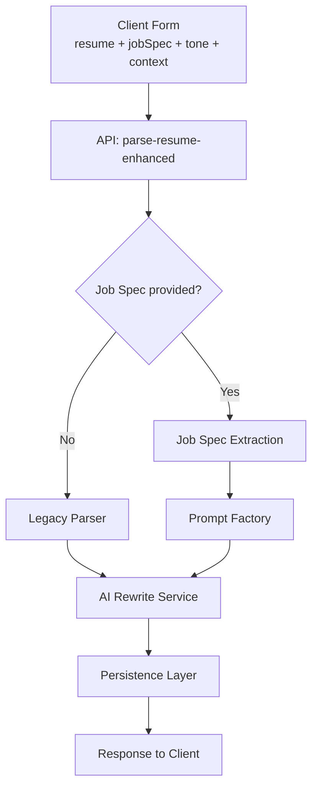

# AI CV GEN

This project is an AI-powered CV/Resume parser that allows users to upload their resumes, parse them using AI, and then generate or edit professional CVs.

## Features

* **AI-Powered Resume Parsing**: Automatically extracts key information from uploaded resumes.
* **Interactive CV Editor**: Users can edit and customize their parsed CVs.
* **Downloadable CVs**: Generate and download CVs in various formats (e.g., PDF).
* **User Authentication**: Secure user management with Supabase.
* **Responsive Design**: Optimized for both desktop and mobile devices.

## Architecture

### High-Level Design



*Green = new components*

> **Diagram validation**  
> All Mermaid diagrams are linted in CI using `@mermaid-js/mermaid-cli` (`mmdc -e`) to prevent parse errors from reaching `main`. See implementation guide Phase 5 for the script.


## Documentation

### Blog Content Management

This project includes comprehensive guides for managing blog content:

#### 📖 For Newcomers
* **[BLOG_ONBOARDING.md](./BLOG_ONBOARDING.md)**: Step-by-step onboarding checklist for your first blog post (start here!)
* **[BLOG_DOCUMENTATION_INDEX.md](./BLOG_DOCUMENTATION_INDEX.md)**: Master index of all blog documentation with usage guide

#### 📚 Core Documentation
* **[BLOG_POST_GUIDE.md](./BLOG_POST_GUIDE.md)**: Complete developer guide for adding new blog posts with step-by-step instructions, SEO considerations, styling guidelines, and troubleshooting tips
* **[BLOG_QUICK_REF.md](./BLOG_QUICK_REF.md)**: Quick reference card for rapid blog post creation with code templates and common patterns
* **[BLOG_POST_TEMPLATE.tsx.example](./BLOG_POST_TEMPLATE.tsx.example)**: Ready-to-copy TypeScript template for new blog posts
* **[BLOG_WORKFLOW.md](./BLOG_WORKFLOW.md)**: Visual workflow diagrams and system architecture

#### 🤖 For AI Assistants
* **[.zed/blog-post-rules.md](./.zed/blog-post-rules.md)**: AI assistant rules for automated blog post creation and management

### Quick Start: Adding a Blog Post

**First time?** Follow the [BLOG_ONBOARDING.md](./BLOG_ONBOARDING.md) checklist!

**Experienced?** Quick workflow:

```bash
# 1. Create directory and copy CSS
mkdir app/blog/your-slug
cp app/blog/resume-writing-tips/page.module.css app/blog/your-slug/

# 2. Copy template
cp BLOG_POST_TEMPLATE.tsx.example app/blog/your-slug/page.tsx

# 3. Update app/blog/your-slug/page.tsx (customize content)
# 4. Update app/blog/page.tsx (add card to Featured Articles as FIRST item)
# 5. Update app/sitemap.ts (add URL to staticPages)
# 6. Run diagnostics to verify
```

For detailed instructions, see **[BLOG_DOCUMENTATION_INDEX.md](./BLOG_DOCUMENTATION_INDEX.md)** or **[BLOG_POST_GUIDE.md](./BLOG_POST_GUIDE.md)**.

## Technologies Used

* **Next.js**: React framework for building full-stack web applications.
* **TypeScript**: Statically typed superset of JavaScript.
* **Tailwind CSS**: Utility-first CSS framework for rapid UI development.
* **Supabase**: Open-source Firebase alternative for database and authentication.
* **Vercel**: Platform for frontend frameworks and static sites.

[](https://vercel.com/jaco-ks-projects/v0-cv)
