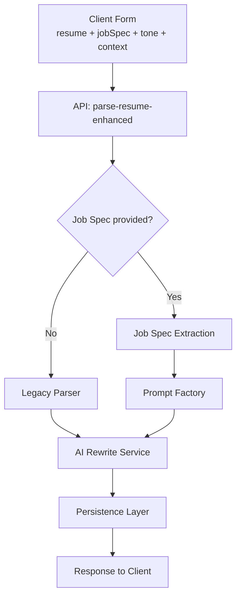

# AI CV GEN

This project is an AI-powered CV/Resume parser that allows users to upload their resumes, parse them using AI, and then generate or edit professional CVs.

## Features

* **AI-Powered Resume Parsing**: Automatically extracts key information from uploaded resumes.
* **Interactive CV Editor**: Users can edit and customize their parsed CVs.
* **Downloadable CVs**: Generate and download CVs in various formats (e.g., PDF).
* **User Authentication**: Secure user management with Supabase.
* **Responsive Design**: Optimized for both desktop and mobile devices.

## Architecture

### High-Level Design

*Green = new components*

> **Diagram validation**  
> All Mermaid diagrams are linted in CI using `@mermaid-js/mermaid-cli` (`mmdc -e`) to prevent parse errors from reaching `main`. See implementation guide Phase 5 for the script.

## Technologies Used

* **Next.js**: React framework for building full-stack web applications.
* **TypeScript**: Statically typed superset of JavaScript.
* **Tailwind CSS**: Utility-first CSS framework for rapid UI development.
* **Supabase**: Open-source Firebase alternative for database and authentication.
* **Vercel**: Platform for frontend frameworks and static sites.

