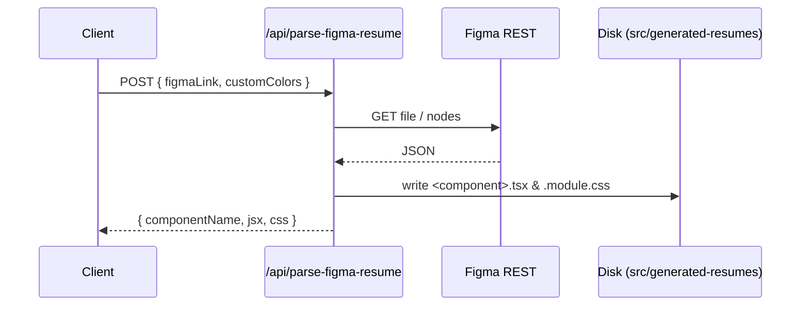

# Internal Developer Docs – Figma Resume Uploader (Use-Case 2)

_Last updated: 2025-07-05_

## Purpose
Allows end-users to paste a **Figma design link** for their resume layout during the uploader phase.  The backend converts the design into JSX + CSS-Module files and binds live data from our `ParsedResume` schema.

---

## Key Components & Flow



| File / Dir | Responsibility |
|------------|----------------|
| `app/api/parse-figma-resume/route.ts` | Fetches design JSON, converts to code, saves files, returns payload |
| `src/components/FigmaLinkUploader/*` | UI: paste link, pick colours, POST to API |
| `src/generated-resumes/` | Auto-generated components land here (git-ignored by default) |
| `app/page-content.tsx` | Shows `FigmaLinkUploader` next to the classic file uploader |

---

## Logic Details

### 1  Node → JSX Mapping
* **TEXT layers** are mapped via heuristics:
  * _contains `name`_   → `{resume.name}`
  * _contains `title`_  → `{resume.title}`
  * _contains `summary`_ → `{resume.summary}`
  * _contains `email`_ → `{resume.contact?.email}`
  * _contains `phone`_ → `{resume.contact?.phone}`
* **FRAME / GROUP / RECTANGLE** become `<div>` with class derived from layer name.

### 2  Persistence
```ts
const genDir = path.join(process.cwd(), 'src', 'generated-resumes');
await fs.writeFile(`${genDir}/${kebab}.tsx`, jsxCode);
```
Files are created server-side so that Cursor (or the developer) can immediately open & refactor.

### 3  Custom Colours
`customColors` array is stored alongside code so generated CSS can reference the same CSS variables.

---

## Extending the Mapping
1. Open `route.ts` and adjust `mapTextContent()` to cover new fields.
2. For nested arrays (experience, education) build list renderers (TBD).

---

## Error Handling
* 400 – invalid link or missing node-id.
* 500 – Figma API failure, missing `FIGMA_API_KEY`, or disk write errors (logged but still returns code to client).

---

## TODO / Future Work
- Support dynamic section loops (experience, skills) instead of static text mapping.
- Upload generated files to Supabase Storage so edits survive serverless deployments.
- Admin dashboard to clean up old generated components.