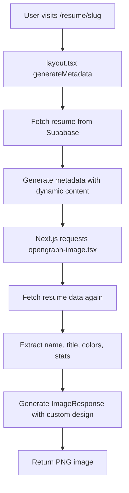

# Open Graph Image Generation Implementation

## Overview

This document outlines the comprehensive Open Graph image generation solution implemented for the CV AI Parser application. The solution provides dynamic, customized images for social media sharing and improves the application's SEO and social media presence.

## Features

### 🎨 Dynamic Resume Images
- **Personalized content**: Each resume gets a unique Open Graph image featuring the person's name, title, and location
- **Custom colors**: Images use the resume's custom color scheme for brand consistency
- **Statistics display**: Shows experience count and skills count as visual elements
- **Professional design**: Modern, clean design with glassmorphism effects

### 🌍 Comprehensive Coverage
- **Individual resumes**: `/resume/[slug]/opengraph-image.tsx` and `/resume/[slug]/twitter-image.tsx`
- **Main application**: `/app/opengraph-image.tsx` and `/app/twitter-image.tsx`
- **Library page**: `/app/library/opengraph-image.tsx`
- **Upload page**: `/app/upload/opengraph-image.tsx`

### 📱 Multi-Platform Support
- **Open Graph**: 1200x630 images for Facebook, LinkedIn, Slack, etc.
- **Twitter**: 1200x1200 square images for Twitter/X
- **Fallback handling**: Graceful degradation when data is unavailable

## Technical Implementation

### Architecture

```
app/
├── opengraph-image.tsx          # Main app Open Graph image
├── twitter-image.tsx            # Main app Twitter image
├── resume/[slug]/
│   ├── layout.tsx               # Dynamic metadata generation
│   ├── opengraph-image.tsx      # Dynamic resume Open Graph image
│   └── twitter-image.tsx        # Dynamic resume Twitter image
├── library/
│   └── opengraph-image.tsx      # Library page Open Graph image
└── upload/
    └── opengraph-image.tsx      # Upload page Open Graph image
```

### Key Components

#### 1. Dynamic Metadata Generation (`app/resume/[slug]/layout.tsx`)

```typescript
export async function generateMetadata({
  params,
}: {
  params: Promise<{ slug: string }>;
}): Promise<Metadata> {
  // Fetch resume data
  const supabase = await createClient();
  const resume = await ResumeDatabase.getPublicResume(supabase, slug);
  
  // Generate dynamic metadata
  return {
    title: `${name} - ${title} | CV AI Parser`,
    description: `View ${name}'s professional resume...`,
    openGraph: {
      title: pageTitle,
      description: description,
      url: resumeUrl,
      siteName: 'CV AI Parser',
      type: 'profile',
    },
    // Images automatically use opengraph-image.tsx
  };
}
```

#### 2. Dynamic Image Generation (`app/resume/[slug]/opengraph-image.tsx`)

```typescript
export default async function Image({ params }: { params: Promise<{ slug: string }> }) {
  const { slug } = await params;
  const resume = await ResumeDatabase.getPublicResume(supabase, slug);
  
  // Extract resume data
  const name = parsed_data.name || 'Professional Resume';
  const title = parsed_data.title || 'Career Professional';
  const primaryColor = parsed_data.customColors?.primary || '#3b82f6';
  
  // Generate image with ImageResponse
  return new ImageResponse(/* JSX component */);
}
```

### Image Specifications

| Platform | Dimensions | Format | Location |
|----------|------------|--------|----------|
| Open Graph | 1200x630 | PNG | `opengraph-image.tsx` |
| Twitter | 1200x1200 | PNG | `twitter-image.tsx` |

### Design System

#### Color Schemes
- **Main App**: Blue gradient (`#3b82f6` → `#1e40af` → `#1e3a8a`)
- **Library**: Green gradient (`#059669` → `#047857` → `#065f46`)
- **Upload**: Purple gradient (`#7c3aed` → `#5b21b6` → `#4c1d95`)
- **Resume Pages**: Uses resume's custom colors with fallback to blue

#### Typography
- **Font**: Inter, system-ui, sans-serif
- **Main title**: 64px (desktop), 48px (mobile)
- **Subtitle**: 28-32px
- **Body text**: 20px
- **Stats**: 24-36px

#### Visual Elements
- **Glassmorphism cards**: `rgba(255, 255, 255, 0.15)` with backdrop blur
- **Decorative circles**: Semi-transparent overlays for depth
- **Icons**: Emoji-based for universal compatibility
- **Gradients**: 135-degree diagonal gradients

## Data Flow

### Resume Page Image Generation



### Error Handling

1. **Database errors**: Falls back to default branded image
2. **Missing resume data**: Shows "Resume Not Found" style
3. **Invalid colors**: Uses default blue color scheme
4. **Network issues**: Graceful degradation with generic content

## SEO and Social Media Benefits

### Improved Sharing
- **Visual appeal**: Professional, branded images for all shared links
- **Context**: Images provide immediate context about the content
- **Brand recognition**: Consistent CV AI Parser branding across all images

### SEO Advantages
- **Rich snippets**: Enhanced search result appearance
- **Social signals**: Improved click-through rates from social media
- **Professional appearance**: Builds trust and credibility

### Platform Optimization
- **Facebook/LinkedIn**: 1200x630 Open Graph images
- **Twitter/X**: 1200x1200 square images
- **Slack/Discord**: Automatic rich previews
- **WhatsApp/Telegram**: Enhanced link previews

## Usage Examples

### Sharing a Resume
When someone shares `https://airesumegen.com/resume/john-doe-123`, social platforms will display:
- **Name**: "John Doe"
- **Title**: "Senior Software Engineer"
- **Location**: "San Francisco, CA"
- **Stats**: "5 Experiences • 12 Skills"
- **Custom colors**: Based on John's resume theme

### Sharing the Main App
When sharing `https://airesumegen.com`, platforms show:
- **Brand**: "CV AI Parser"
- **Tagline**: "Transform Your Resume with AI"
- **Features**: AI Powered, Customizable, PDF Export
- **Call to action**: "Upload • Parse • Customize • Share"

## Performance Considerations

### Caching
- **Next.js automatic caching**: Images are cached at the edge
- **Browser caching**: Long cache headers for static content
- **CDN optimization**: Served through Vercel's CDN

### Generation Speed
- **Server-side rendering**: Images generated on-demand
- **Optimized queries**: Single database query per image
- **Fallback strategy**: Quick fallback for errors

### Resource Usage
- **Memory efficient**: ImageResponse optimized for serverless
- **Bandwidth conscious**: PNG compression with optimal quality
- **CPU optimized**: Minimal processing for maximum speed

## Testing and Validation

### Social Media Debuggers
- **Facebook Sharing Debugger**: https://developers.facebook.com/tools/debug/
- **Twitter Card Validator**: https://cards-dev.twitter.com/validator
- **LinkedIn Post Inspector**: https://www.linkedin.com/post-inspector/

### Local Testing
```bash
# Visit these URLs to test image generation
http://localhost:3000/opengraph-image
http://localhost:3000/resume/[slug]/opengraph-image
http://localhost:3000/library/opengraph-image
http://localhost:3000/upload/opengraph-image
```

### Validation Checklist
- [ ] Images load correctly for all pages
- [ ] Resume data appears accurately in images
- [ ] Custom colors are applied properly
- [ ] Fallback images work when data is missing
- [ ] Images appear correctly in social media previews
- [ ] Performance is acceptable (<2s generation time)

## Future Enhancements

### Planned Features
1. **Profile pictures**: Include user avatars in resume images
2. **Skill badges**: Visual representation of top skills
3. **Company logos**: Display previous company logos
4. **QR codes**: Include QR codes linking to full resume

### Advanced Customization
1. **Template variety**: Multiple image layout options
2. **Brand themes**: Industry-specific color schemes
3. **Localization**: Multi-language support
4. **Analytics**: Track image performance and engagement

## Troubleshooting

### Common Issues

#### Image Not Updating
- Clear social media cache using platform debuggers
- Check for browser caching issues
- Verify database connection and data freshness

#### Styling Issues
- Validate JSX syntax in ImageResponse components
- Check color format (hex values required)
- Ensure proper element positioning and sizing

#### Performance Problems
- Monitor database query performance
- Check for memory leaks in image generation
- Optimize image complexity and file sizes

### Debug Commands
```bash
# Check image generation locally
curl http://localhost:3000/api/og/resume/[slug]

# Validate metadata generation
curl -I http://localhost:3000/resume/[slug]

# Test fallback behavior
curl http://localhost:3000/resume/invalid-slug/opengraph-image
```

## Conclusion

The Open Graph image generation system provides a comprehensive, scalable solution for creating dynamic, branded images across the CV AI Parser application. The implementation follows Next.js best practices, provides excellent performance, and significantly enhances the user experience when sharing content on social media platforms.

The system is designed to be maintainable, extensible, and robust, with proper error handling and fallback mechanisms to ensure reliability in production environments.