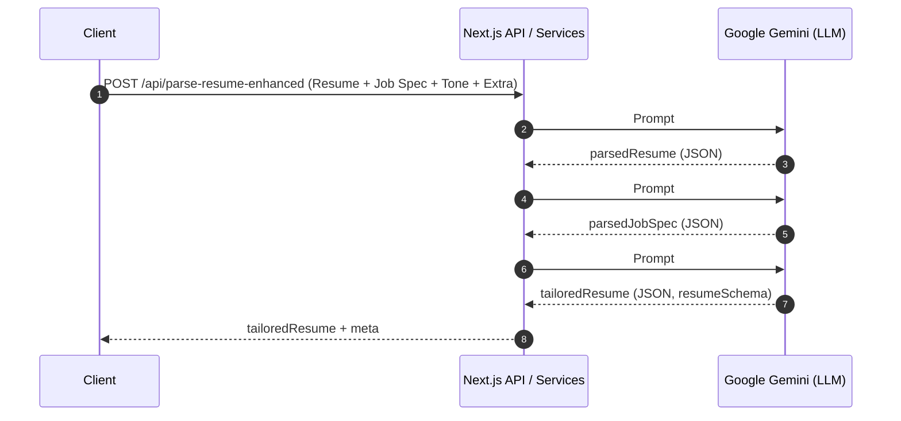

# CV AI Parser – Technical Architecture Design  
*(Backend processing pipeline)*  

---

## 1. Current State Summary

### 1.1 High-Level Flow (today)

1. **Client** submits a `<form>` containing:  
   • `file` (resume) • `customColors` • `isAuthenticated` flag  
2. **API Route** `/api/parse-resume` (`app/api/parse-resume/route.ts`)  
   a. Validates file & (optionally) user session  
   b. Chooses parsing strategy  
      - `parseWithAIPDF()` for PDF   
      - `parseWithAI()` for TXT/others  
      - `parseWithRegex()` fallback  
   c. Merges `customColors`, creates `finalParsedData`  
   d. Persists parsed resume (if user logged-in) via `ResumeDatabase.saveResume()`  
   e. Returns `{ data: finalParsedData, meta:{…} }` to client  
3. **Frontend** renders/edits resume – *out of scope*.

### 1.2 Key Files & Components

| Layer | File / Module | Role |
|-------|---------------|------|
| API   | `app/api/parse-resume/route.ts` | Entry-point for resume parsing |
| Parsing – AI | `lib/resume-parser/ai-parser.ts`<br>• `parseWithAI()`<br>• `parseWithAIPDF()` | Calls Gemini via `generateObject()` |
| Parsing – Regex | `lib/resume-parser/regex-parser.ts` | Heuristic fallback parser |
| Prompt templates | `lib/resume-parser/prompts.ts` | Returns parsing prompts |
| Schema | `lib/resume-parser/schema.ts` | Zod schemas; `resumeSchema`, `aiResumeSchema` |
| Persistence | `lib/database.ts` (`ResumeDatabase`) | CRUD for `resumes`, `resume_versions` tables |
| Utils | `lib/utils.ts` (`createSlug`) | Slug generator |
| Config | `lib/config.ts` | Feature flags & constants |

---

## 2. New Feature Requirements – Key Goals

1. **Optional Job Specification Input**  
   • Accept PDF/TXT upload *or* pasted text (≤ 1000 chars).

2. **Tone of Voice**  
   • `"Formal"` | `"Neutral"` | `"Creative"`.

3. **Additional Context Prompt**  
   • Free-text ≤ 300 chars.

4. **Processing**  
   • Extract structured data from Job Spec (skills, experience, values, etc.).  
   • Generate a *dynamic* AI prompt that blends:  
     a) Original parsed resume  
     b) Extracted Job Spec data  
     c) Selected tone  
     d) Additional context  
   • Produce a **tailored resume** aligned to the Job Spec.

5. **Persistence**  
   • Store Job Spec reference, tone, and context (`userAdditionalContext`) with the resume.

---

## 3. Proposed Architecture

### 3.1 High-Level Design

```mermaid
flowchart TD
    A[Client Form<br/>resume + jobSpec + tone + context] --> B[/api/parse-resume-enhanced/]
    B --> C{Job Spec?}
    C -- No --> D[Legacy Parser<br/>(existing flow)]
    C -- Yes --> E[Job Spec Extraction<br/>(jobSpecExtractor)]
    E --> F[Prompt Factory<br/>(dynamicPromptGenerator)]
    D --> G[AI Rewrite Service<br/>tailorResume()]
    F --> G
    G --> H[Persistence Layer<br/>ResumeDatabase (+Context)]
    H --> I[Response to Client<br/>{ tailoredResume, meta }]
```

*Green = new components*

### 3.2 Component Breakdown

| Component | Type | Responsibility | New / Modified |
|-----------|------|----------------|----------------|
| `parse-resume-enhanced` API route | Next.js Route | Single entry-point handling both classic & enhanced flows. Replaces/extends existing route. | **Modified** |
| `jobSpecExtractor.ts` | Service | Uses Gemini (or fallback regex) + `jobSpecSchema` to return structured data `{ skills:[], yearsExp:…, values:… }`. | **New** |
| `dynamicPromptGenerator.ts` | Service | Builds final prompt string/object from: resume, jobSpecData, tone, additionalContext. | **New** |
| `tailorResume.ts` | Service | Calls LLM with generated prompt, returns rewritten resume (same `resumeSchema` shape). | **New** |
| `userAdditionalContext` | Data Model | `{ jobSpec: {type:'text'|'file', text?|fileUrl?}, tone:'Formal'|'Neutral'|'Creative', extraPrompt?:string }` | **New** |
| DB changes | Schema | Add JSONB column `additional_context` to `resumes` or create table `resume_contexts`. | **Modified** |
| Zod Schemas | `jobSpecSchema`, `userAdditionalContextSchema` | Validation for Job Spec extraction & user context. | **New** |

### 3.3 Data Models / Schemas

#### 3.3.1 `userAdditionalContext`

```ts
interface UserAdditionalContext {
  jobSpecSource: 'upload' | 'pasted';
  jobSpecText?: string;      // normalized text (≤1000 chars)
  jobSpecFileUrl?: string;   // Supabase storage URL
  tone: 'Formal' | 'Neutral' | 'Creative';
  extraPrompt?: string;      // ≤300 chars
}
```

#### 3.3.2 Job Spec Zod Schema (`jobSpecSchema`)

```ts
import { z } from 'zod';

export const jobSpecSchema = z.object({
  positionTitle: z.string().describe('Role title, e.g., "Frontend Engineer"'),
  requiredSkills: z.array(z.string()).describe('Stack & soft skills keywords'),
  yearsExperience: z
    .number()
    .int()
    .min(0)
    .optional()
    .describe('Minimum total years of experience'),
  responsibilities: z.array(z.string()).optional(),
  companyValues: z.array(z.string()).optional(),
});
export type ParsedJobSpec = z.infer<typeof jobSpecSchema>;
```

### 3.4 Prompt Engineering Strategy

1. **System Message** – “You are an expert resume writer…”
2. **User Context** – JSON blobs:  
   - `resume` (original parsed resume)  
   - `jobSpecData` (output of `jobSpecExtractor`)  
   - `tone`  
   - `extraPrompt`
3. **Instructions**  
   - Align resume wording with required skills & responsibilities  
   - Emphasise achievements that match job spec  
   - Maintain chronological integrity  
   - Apply selected tone (Formal/Neutral/Creative) consistently  
   - Respect length constraints (no section > X chars)

Pseudocode:

```ts
export function buildTailorPrompt(args: {
  resume: ParsedResume;
  jobSpec: ParsedJobSpec;
  tone: Tone;
  extra?: string;
}) => string { … }
```

### 3.5 API Endpoints

| Method | Path | Auth | Description |
|--------|------|------|-------------|
| `POST` | `/api/parse-resume` | optional | **Deprecated** once new route stable |
| `POST` | `/api/parse-resume-enhanced` | optional | Accepts `FormData` with fields: `file` (resume), `jobSpecFile?`, `jobSpecText?`, `tone`, `extraPrompt`, `customColors`, `isAuthenticated` |
| `GET`  | `/api/resume/:slug` | public | Unchanged |
| `PUT`  | `/api/resumes/:id` | auth | Unchanged (will accept updated tailored data) |

### 3.6 Integration Points

* Existing front-end uploader will pass new fields → minimal change.  
* Database write goes through `ResumeDatabase.saveResume()` – add params.  
* AI inference still centralised via `ai-sdk/google`; reuse `AI_MODEL` constant.  
* Feature flags (`IS_AI_PARSING_ENABLED`) continue to gate AI usage.

---

## 4. Implementation Strategy

| Step | Task | Notes |
|------|------|-------|
| 1 | DB migration – add `additional_context` JSONB column, index on `resume_id` if new table created. |
| 2 | Create **Zod schemas** (`jobSpecSchema`, `userAdditionalContextSchema`). |
| 3 | Implement `jobSpecExtractor.ts`  
   • Attempt GPT/Gemini extraction → validate with `jobSpecSchema`.  
   • Fallback regex for offline/dev mode. |
| 4 | Implement `dynamicPromptGenerator.ts` and `tailorResume.ts`.|
| 5 | **Refactor API route**  
   - Rename existing to `parse-resume-legacy` (keep for rollback).  
   - New route orchestrates classic flow OR enhanced flow. |
| 6 | Extend `ResumeDatabase.saveResume()` signature + add column mapping. |
| 7 | Unit tests  
   • Parsing accuracy (fixtures)  
   • Prompt generator snapshot tests |
| 8 | Load test LLM calls; cache identical job spec extraction requests. |
| 9 | Update environment docs (new vars, quotas). |
| 10 | Roll-out with feature flag `IS_JOB_TAILORING_ENABLED`. |

### 4.1 Risks & Mitigations

| Risk | Impact | Mitigation |
|------|--------|-----------|
| LLM cost / latency | Slow UX | Use streaming responses; lightweight extraction model; cache jobSpec result |
| Inaccurate extraction | Poor tailoring | Validate with Zod; confidence score; fallback to manual review |
| Schema drift | Runtime errors | Strong typing (`z.infer<>`), integration tests |
| DB row size limits | Resume + context JSON large | Compress or split into separate table |

### 4.2 Performance Considerations

* **Parallel Calls** – Run job spec extraction & resume parsing concurrently where possible.  
* **Streaming** – Send partial tailored resume chunks to client for progressive rendering.  
* **Caching** – Deduplicate identical job spec uploads (hash on content).  

## 5. LLM Orchestration & Responsibility Split

The diagram and table below clarify which parts of the enhanced pipeline are handled by **your backend code** and which are performed by the **LLM (Google Gemini)**.



| Stage | LLM’s Responsibility | Backend Responsibility |
|-------|----------------------|------------------------|
| **Extraction** | Understand free-form text and emit JSON exactly matching the schema supplied in the prompt. | Craft prompts, supply schema via `generateObject`, validate with Zod, retry or fallback if invalid. |
| **Tailoring** | Rewrite resume content, inject keywords, adjust tone, return JSON in agreed shape. | Combine extracted JSON blobs + tone/context into a single instruction prompt; enforce length/style constraints; validate output. |
| **Persistence & Business Rules** | *N/A* | Decide whether to tailor, handle feature flags, store all versions, measure confidence, throttle/cost-guard, etc. |

**Key takeaway:** the LLM performs the semantic heavy-lifting (parsing & rewriting), but reliable output requires orchestration, validation, and storage logic provided by your code.

---

## 6. Conclusion

The proposed architecture introduces isolated, testable services (`jobSpecExtractor`, `dynamicPromptGenerator`, `tailorResume`) that slot into the existing parsing pipeline with minimal surface-area change.  
It preserves robustness (schema validation & fallbacks), remains maintainable (modular files, typed Zod schemas), and keeps performance in check (parallelism, caching).  

This design provides a clear roadmap for extending the CV parser to produce job-specific tailored resumes while safeguarding existing functionality.