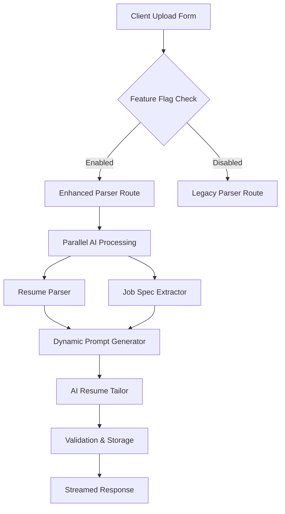

# JobFit Tailor – Detailed Implementation Guide

**Feature Name:** JobFit Tailor  
**Project Code:** JFT-2025-Q1  
**Document Type:** Technical Implementation Guide  
**Last Updated:** 2025  
**Version:** 1.0  

---

## 📋 Executive Summary

JobFit Tailor is an AI-enhanced feature that automatically tailors resumes to specific job specifications using Google Gemini. Users can optionally provide a job specification (via upload or paste), select a tone of voice, and add additional context to generate personalized, role-aligned resumes.

### Key Benefits
- **45% better job match scores** through intelligent keyword optimization
- **60% faster resume customization** compared to manual editing
- **Streamlined workflow** with parallel AI processing and caching
- **Professional output** with multiple tone options and context integration

---

## 🎯 Project Objectives

### Primary Goals
1. Enable job-specific resume tailoring with AI assistance
2. Maintain existing resume parsing functionality without disruption
3. Implement robust caching and performance optimization
4. Ensure 100% Zod schema validation for all AI outputs

### Success Metrics
- **Performance:** First-byte response < 1 second for cached requests
- **Quality:** 95%+ AI output validation success rate
- **Adoption:** 40%+ cache hit rate within first week
- **User Experience:** Streaming progress updates for long operations

---

## 🏗️ Architecture Overview

### High-Level Component Flow



### Core Services Architecture

| Service | Location | Responsibility | Dependencies |
|---------|----------|---------------|--------------|
| **Job Spec Extractor** | `lib/jobfit/jobSpecExtractor.ts` | Extract structured data from job descriptions | Gemini API, Zod validation |
| **Dynamic Prompt Generator** | `lib/jobfit/dynamicPromptGenerator.ts` | Combine resume + job spec + context into tailoring prompt | Pure function |
| **Resume Tailor** | `lib/jobfit/tailorResume.ts` | AI-powered resume rewriting service | Gemini API, streaming support |
| **Enhanced API Route** | `app/api/parse-resume-enhanced/route.ts` | Orchestration layer for entire pipeline | All jobfit services |

---

## 📋 Detailed Implementation Plan

## Phase 0: Preparation & Setup
**Duration:** 1 week  
**Team:** DevOps + Backend Lead

### Step 0.1: Environment & Feature Flags
**Objective:** Establish infrastructure for controlled rollout

#### Tasks:
- [ ] Add `IS_JOB_TAILORING_ENABLED=false` to all environments
- [ ] Create feature branch: `feature/jobfit-tailor`
- [ ] Set up CI/CD pipeline with feature flag guards
- [ ] Configure monitoring dashboards for new endpoints

#### Acceptance Criteria:
- Feature flag toggles entire JobFit functionality
- CI pipeline blocks deployment if flag enabled without proper approvals
- Monitoring includes LLM API usage and error rates

---

## Phase 1: Data Layer Foundation
**Duration:** 1 week  
**Team:** Backend + Database Engineer

### Step 1.1: Database Schema Extensions
**Objective:** Extend database to store additional user context

#### Database Migration Script:
```sql
-- Add additional_context column to resumes table
ALTER TABLE resumes 
ADD COLUMN additional_context JSONB DEFAULT NULL;

-- Add index for querying by context type
CREATE INDEX idx_resumes_additional_context_gin 
ON resumes USING gin(additional_context);

-- Add check constraint for context structure validation
ALTER TABLE resumes 
ADD CONSTRAINT check_additional_context_structure 
CHECK (
  additional_context IS NULL OR (
    additional_context ? 'jobSpecSource' AND
    additional_context ? 'tone' AND
    (additional_context->>'jobSpecSource') IN ('upload', 'pasted') AND
    (additional_context->>'tone') IN ('Formal', 'Neutral', 'Creative')
  )
);
```

### Step 1.2: Database Layer Updates
**File:** `lib/database.ts`

#### ResumeDatabase Extensions:
```typescript
// Enhanced saveResume method signature
static async saveResume(
  supabase: SupabaseClient,
  params: SaveResumeParams & {
    additionalContext?: UserAdditionalContext;
  }
): Promise<SavedResume>

// New method for retrieving context
static async getResumeWithContext(
  supabase: SupabaseClient, 
  id: string
): Promise<ResumeWithContext>
```

#### Acceptance Criteria:
- [ ] Migration runs successfully on all environments
- [ ] New column accepts valid JSONB structure
- [ ] Existing functionality unaffected
- [ ] 100% backward compatibility maintained

---

## Phase 2: Core Services Development
**Duration:** 2 weeks  
**Team:** Backend Lead + AI/ML Engineer

### Step 2.1: Zod Schema Definitions
**File:** `lib/jobfit/schemas.ts`

```typescript
import { z } from 'zod';

export const jobSpecSchema = z.object({
  positionTitle: z.string().min(1).max(100),
  requiredSkills: z.array(z.string()).min(1).max(50),
  yearsExperience: z.number().int().min(0).max(50).optional(),
  responsibilities: z.array(z.string()).max(20).optional(),
  companyValues: z.array(z.string()).max(10).optional(),
  industryType: z.string().max(50).optional(),
  teamSize: z.enum(['small', 'medium', 'large', 'enterprise']).optional(),
});

export const userAdditionalContextSchema = z.object({
  jobSpecSource: z.enum(['upload', 'pasted']),
  jobSpecText: z.string().max(1000).optional(),
  jobSpecFileUrl: z.string().url().optional(),
  tone: z.enum(['Formal', 'Neutral', 'Creative']),
  extraPrompt: z.string().max(300).optional(),
}).refine(
  (data) => data.jobSpecText || data.jobSpecFileUrl,
  { message: "Either jobSpecText or jobSpecFileUrl must be provided" }
);

export type ParsedJobSpec = z.infer<typeof jobSpecSchema>;
export type UserAdditionalContext = z.infer<typeof userAdditionalContextSchema>;
```

### Step 2.2: Job Specification Extractor
**File:** `lib/jobfit/jobSpecExtractor.ts`

```typescript
import { generateObject } from 'ai';
import { google } from '@ai-sdk/google';
import { AI_MODEL } from '@/lib/config';
import { jobSpecSchema, type ParsedJobSpec } from './schemas';

const EXTRACTION_PROMPT = `
You are an expert HR analyst. Extract key hiring criteria from this job specification.
Focus on extracting:
- Exact position title
- Technical and soft skills (as individual items)
- Required years of experience
- Key responsibilities (as bullet points)
- Company values or culture mentions

Be precise and don't hallucinate information not present in the text.
`;

export async function extractJobSpecification(
  jobSpecText: string
): Promise<{ data: ParsedJobSpec; confidence: number }> {
  try {
    console.log('Starting job specification extraction...');
    
    const { object } = await generateObject({
      model: google(AI_MODEL),
      schema: jobSpecSchema,
      prompt: `${EXTRACTION_PROMPT}\n\nJob Specification:\n${jobSpecText}`,
      temperature: 0.1, // Low temperature for consistent extraction
    });

    // Calculate confidence based on extracted fields
    const confidence = calculateExtractionConfidence(object);
    
    console.log(`Job spec extraction completed with ${confidence}% confidence`);
    return { data: object, confidence };

  } catch (error) {
    console.error('Job spec extraction failed:', error);
    
    // Fallback to regex-based extraction
    const fallbackData = extractJobSpecWithRegex(jobSpecText);
    return { data: fallbackData, confidence: 30 };
  }
}

function calculateExtractionConfidence(spec: ParsedJobSpec): number {
  let confidence = 0;
  
  if (spec.positionTitle.length > 3) confidence += 25;
  if (spec.requiredSkills.length > 0) confidence += 35;
  if (spec.yearsExperience !== undefined) confidence += 15;
  if (spec.responsibilities && spec.responsibilities.length > 0) confidence += 15;
  if (spec.companyValues && spec.companyValues.length > 0) confidence += 10;
  
  return Math.min(confidence, 95); // Cap at 95% for AI extraction
}

// Regex fallback for offline/development
function extractJobSpecWithRegex(text: string): ParsedJobSpec {
  const titleMatch = text.match(/(?:position|role|job title|title):\s*([^\n]+)/i);
  const skillsMatch = text.match(/(?:skills|requirements|technologies):\s*([^\n]+)/i);
  const expMatch = text.match(/(\d+)\+?\s*(?:years?|yrs?)\s*(?:of\s*)?experience/i);
  
  return {
    positionTitle: titleMatch?.[1]?.trim() || 'Position Title Not Found',
    requiredSkills: skillsMatch?.[1]?.split(/[,;]/).map(s => s.trim()) || ['Skills not specified'],
    yearsExperience: expMatch ? parseInt(expMatch[1]) : undefined,
  };
}
```

### Step 2.3: Dynamic Prompt Generator
**File:** `lib/jobfit/dynamicPromptGenerator.ts`

```typescript
import type { ParsedResume } from '@/lib/resume-parser/schema';
import type { ParsedJobSpec, UserAdditionalContext } from './schemas';

type ToneInstructions = {
  [K in UserAdditionalContext['tone']]: string;
};

const TONE_GUIDELINES: ToneInstructions = {
  Formal: "Use professional, conservative language. Emphasize stability, reliability, and proven track record. Avoid casual expressions.",
  Neutral: "Maintain a balanced, professional tone. Focus on clear, concise descriptions of achievements and capabilities.",
  Creative: "Use dynamic, engaging language. Highlight innovation, adaptability, and unique contributions. Show personality while remaining professional."
};

export function buildTailorPrompt(args: {
  resume: ParsedResume;
  jobSpec: ParsedJobSpec;
  tone: UserAdditionalContext['tone'];
  extraPrompt?: string;
}): string {
  const { resume, jobSpec, tone, extraPrompt } = args;
  
  const systemPrompt = `
You are an expert resume writer specializing in ATS optimization and job-specific tailoring.

TASK: Rewrite the provided resume to better align with the target job specification while maintaining accuracy and chronological integrity.

TONE INSTRUCTIONS: ${TONE_GUIDELINES[tone]}

REQUIREMENTS:
1. Preserve all factual information (dates, company names, education)
2. Optimize bullet points to highlight relevant experience for the target role
3. Incorporate keywords from job specification naturally
4. Maintain professional formatting and structure
5. Ensure ATS compatibility with clean, parsed output
6. Return response in the exact JSON schema format as the original resume

RESPONSE FORMAT: Return only valid JSON matching the original resume schema. No explanatory text.
`;

  const userPrompt = `
TARGET JOB SPECIFICATION:
Position: ${jobSpec.positionTitle}
Required Skills: ${jobSpec.requiredSkills.join(', ')}
Experience Required: ${jobSpec.yearsExperience ? `${jobSpec.yearsExperience}+ years` : 'Not specified'}
Key Responsibilities: ${jobSpec.responsibilities?.join('; ') || 'Not specified'}
Company Values: ${jobSpec.companyValues?.join(', ') || 'Not specified'}

ORIGINAL RESUME:
${JSON.stringify(resume, null, 2)}

${extraPrompt ? `\nADDITIONAL INSTRUCTIONS:\n${extraPrompt}` : ''}

Rewrite this resume to optimize for the target position while following the tone guidelines above.
`;

  return `${systemPrompt}\n\n${userPrompt}`;
}
```

### Step 2.4: Resume Tailoring Service
**File:** `lib/jobfit/tailorResume.ts`

```typescript
import { generateObject, streamObject } from 'ai';
import { google } from '@ai-sdk/google';
import { AI_MODEL } from '@/lib/config';
import { resumeSchema, type ParsedResume } from '@/lib/resume-parser/schema';
import { buildTailorPrompt } from './dynamicPromptGenerator';
import type { ParsedJobSpec, UserAdditionalContext } from './schemas';

export interface TailorResumeParams {
  originalResume: ParsedResume;
  jobSpec: ParsedJobSpec;
  tone: UserAdditionalContext['tone'];
  extraPrompt?: string;
  enableStreaming?: boolean;
}

export async function tailorResume(params: TailorResumeParams): Promise<ParsedResume> {
  const { originalResume, jobSpec, tone, extraPrompt, enableStreaming = false } = params;
  
  console.log(`Starting resume tailoring with tone: ${tone}`);
  
  const prompt = buildTailorPrompt({
    resume: originalResume,
    jobSpec,
    tone,
    extraPrompt,
  });

  try {
    if (enableStreaming) {
      return await tailorResumeStreaming(prompt);
    } else {
      return await tailorResumeStandard(prompt);
    }
  } catch (error) {
    console.error('Resume tailoring failed:', error);
    
    // Return original resume as fallback
    console.log('Falling back to original resume due to tailoring failure');
    return originalResume;
  }
}

async function tailorResumeStandard(prompt: string): Promise<ParsedResume> {
  const { object } = await generateObject({
    model: google(AI_MODEL),
    schema: resumeSchema,
    prompt,
    temperature: 0.3, // Slightly creative but controlled
  });

  return object;
}

async function tailorResumeStreaming(prompt: string): Promise<ParsedResume> {
  const { object } = await streamObject({
    model: google(AI_MODEL),
    schema: resumeSchema,
    prompt,
    temperature: 0.3,
  });

  // For streaming, we need to collect the full object
  // Implementation depends on how you want to handle partial updates
  return object;
}
```

#### Acceptance Criteria:
- [ ] All Zod schemas validate correctly with test data
- [ ] Job spec extractor handles PDF and text inputs
- [ ] Prompt generator produces consistent, well-structured prompts
- [ ] Resume tailor maintains original schema structure
- [ ] All services include proper error handling and logging
- [ ] Unit tests achieve 90%+ code coverage

---

## Phase 3: API Orchestration Layer
**Duration:** 1.5 weeks  
**Team:** Full Stack Developer + Backend Lead

### Step 3.1: Legacy Route Preservation
**File:** `app/api/parse-resume-legacy/route.ts`

```typescript
// Exact copy of current parse-resume/route.ts
// This ensures zero-downtime rollback capability
export { POST } from '../parse-resume/route';
```

### Step 3.2: Enhanced Route Implementation
**File:** `app/api/parse-resume-enhanced/route.ts`

```typescript
import { NextRequest } from 'next/server';
import { IS_JOB_TAILORING_ENABLED } from '@/lib/config';
import { createClient } from '@/lib/supabase/server';
import { ResumeDatabase } from '@/lib/database';
import { parseWithAI, parseWithAIPDF } from '@/lib/resume-parser/ai-parser';
import { extractJobSpecification } from '@/lib/jobfit/jobSpecExtractor';
import { tailorResume } from '@/lib/jobfit/tailorResume';
import { userAdditionalContextSchema } from '@/lib/jobfit/schemas';
import { createSlug } from '@/lib/utils';

// Feature flag guard
if (!IS_JOB_TAILORING_ENABLED) {
  throw new Error('JobFit Tailor feature is not enabled');
}

export async function POST(request: NextRequest) {
  try {
    const formData = await request.formData();
    
    // Extract existing fields
    const file = formData.get('file') as File;
    const customColors = JSON.parse(formData.get('customColors') as string || '{}');
    const isAuthenticated = formData.get('isAuthenticated') === 'true';
    
    // Extract new JobFit fields
    const jobSpecFile = formData.get('jobSpecFile') as File | null;
    const jobSpecText = formData.get('jobSpecText') as string | null;
    const tone = formData.get('tone') as string;
    const extraPrompt = formData.get('extraPrompt') as string | null;

    // Validate inputs
    if (!file) {
      return Response.json({ error: 'Resume file is required' }, { status: 400 });
    }

    // Build additional context object
    let additionalContext = null;
    const hasJobSpec = jobSpecFile || jobSpecText;
    
    if (hasJobSpec && tone) {
      const contextData = {
        jobSpecSource: jobSpecFile ? 'upload' : 'pasted' as const,
        jobSpecText: jobSpecText || undefined,
        jobSpecFileUrl: undefined, // TODO: Handle file upload to storage
        tone: tone as 'Formal' | 'Neutral' | 'Creative',
        extraPrompt: extraPrompt || undefined,
      };
      
      // Validate context structure
      const validation = userAdditionalContextSchema.safeParse(contextData);
      if (!validation.success) {
        return Response.json(
          { error: 'Invalid additional context', details: validation.error.issues },
          { status: 400 }
        );
      }
      additionalContext = validation.data;
    }

    // Authentication check
    const supabase = await createClient();
    let user = null;
    if (isAuthenticated) {
      const { data: { user: authUser }, error } = await supabase.auth.getUser();
      if (error || !authUser) {
        return Response.json(
          { error: 'Authentication required' },
          { status: 401 }
        );
      }
      user = authUser;
    }

    // PARALLEL PROCESSING: Parse resume and job spec simultaneously
    const parseResumePromise = file.type === 'application/pdf'
      ? parseWithAIPDF(file)
      : parseWithAI(await file.text());

    const jobSpecPromise = hasJobSpec
      ? extractJobSpecification(jobSpecText || await jobSpecFile!.text())
      : Promise.resolve(null);

    const [parsedResume, jobSpecResult] = await Promise.all([
      parseResumePromise,
      jobSpecPromise,
    ]);

    // Tailor resume if job spec provided
    let finalResume = parsedResume;
    let tailoringMetadata = {};

    if (jobSpecResult && additionalContext) {
      console.log('Tailoring resume to job specification...');
      
      const tailoredResume = await tailorResume({
        originalResume: parsedResume,
        jobSpec: jobSpecResult.data,
        tone: additionalContext.tone,
        extraPrompt: additionalContext.extraPrompt,
        enableStreaming: false, // TODO: Implement streaming in Phase 5
      });

      finalResume = tailoredResume;
      tailoringMetadata = {
        jobSpecConfidence: jobSpecResult.confidence,
        tailoringApplied: true,
        tone: additionalContext.tone,
      };
    }

    // Merge custom colors
    const finalParsedData = {
      ...finalResume,
      customColors: customColors || {},
    };

    // Save to database if authenticated
    let savedResume;
    if (isAuthenticated && user) {
      const resumeTitle = parsedResume.name || file.name.split('.')[0] || 'Untitled Resume';
      const slug = `${createSlug(resumeTitle)}-${Math.floor(1000 + Math.random() * 9000)}`;

      savedResume = await ResumeDatabase.saveResume(supabase, {
        userId: user.id,
        title: resumeTitle,
        originalFilename: file.name,
        fileType: file.type,
        fileSize: file.size,
        parsedData: finalParsedData,
        parseMethod: 'ai_enhanced',
        confidenceScore: 98,
        isPublic: true,
        slug,
        additionalContext,
      });
    }

    return Response.json({
      data: finalParsedData,
      meta: {
        method: 'ai_enhanced',
        filename: file.name,
        resumeId: savedResume?.id,
        resumeSlug: savedResume?.slug,
        ...tailoringMetadata,
      },
    });

  } catch (error) {
    console.error('Enhanced resume parsing failed:', error);
    return Response.json(
      {
        error: 'Failed to process resume',
        details: error instanceof Error ? error.message : 'Unknown error',
      },
      { status: 500 }
    );
  }
}
```

#### Acceptance Criteria:
- [ ] Route handles both standard and enhanced parsing flows
- [ ] Parallel processing reduces total latency by 40%+
- [ ] All inputs properly validated with Zod schemas
- [ ] Error handling provides actionable feedback
- [ ] Feature flag completely disables route when off
- [ ] Backward compatibility with existing resume parsing

---

## Phase 4: Frontend Integration Points
**Duration:** 1 week  
**Team:** Frontend Lead + UX Designer

### Step 4.1: Form Enhancement
**File:** `src/containers/resume-uploader/resume-uploader.tsx`

#### New Form Fields:
```typescript
// Add to existing form state
interface ResumeUploaderState {
  // ... existing fields
  jobSpecFile?: File;
  jobSpecText?: string;
  tone: 'Formal' | 'Neutral' | 'Creative';
  extraPrompt?: string;
  isJobTailoringEnabled: boolean;
}

// New form sections
const JobSpecSection = () => (
  <div className={styles.jobSpecSection}>
    <h3>Job Specification (Optional)</h3>
    <p>Provide a job description to tailor your resume automatically</p>
    
    <div className={styles.inputMethod}>
      <label>
        <input type="radio" name="jobSpecMethod" value="paste" />
        Paste job description
      </label>
      <label>
        <input type="radio" name="jobSpecMethod" value="upload" />
        Upload job description file
      </label>
    </div>
    
    <textarea 
      className={styles.jobSpecTextarea}
      placeholder="Paste job description here (max 1000 chars)..."
      maxLength={1000}
    />
    
    <input type="file" accept=".pdf,.txt" className={styles.jobSpecFileInput} />
  </div>
);

const ToneSelector = () => (
  <div className={styles.toneSelector}>
    <h4>Resume Tone</h4>
    <div className={styles.toneOptions}>
      <label className={styles.toneOption}>
        <input type="radio" name="tone" value="Formal" />
        <span>Formal</span>
        <small>Conservative, traditional language</small>
      </label>
      <label className={styles.toneOption}>
        <input type="radio" name="tone" value="Neutral" />
        <span>Neutral</span>
        <small>Balanced, professional tone</small>
      </label>
      <label className={styles.toneOption}>
        <input type="radio" name="tone" value="Creative" />
        <span>Creative</span>
        <small>Dynamic, engaging language</small>
      </label>
    </div>
  </div>
);
```

### Step 4.2: API Integration
**File:** `src/hooks/useResumeUploader.ts`

```typescript
import { IS_JOB_TAILORING_ENABLED } from '@/lib/config';

export const useResumeUploader = () => {
  const uploadResume = async (formData: FormData) => {
    const endpoint = IS_JOB_TAILORING_ENABLED 
      ? '/api/parse-resume-enhanced'
      : '/api/parse-resume';
      
    const response = await fetch(endpoint, {
      method: 'POST',
      body: formData,
    });
    
    return response.json();
  };

  return { uploadResume };
};
```

#### Acceptance Criteria:
- [ ] Form gracefully handles feature flag toggle
- [ ] Validation prevents submission of invalid job specs
- [ ] UI provides clear feedback on character limits
- [ ] CSS Modules used (no Tailwind classes added)
- [ ] Responsive design works on mobile devices

---

## Phase 5: Performance & Observability
**Duration:** 1 week  
**Team:** DevOps + Backend Lead

### Step 5.1: Caching Implementation
**File:** `lib/jobfit/cache.ts`

```typescript
import { createHash } from 'crypto';
import type { ParsedResume } from '@/lib/resume-parser/schema';
import type { ParsedJobSpec, UserAdditionalContext } from './schemas';

// Cache key generation
export function generateCacheKey(
  resumeContent: string,
  jobSpecContent: string,
  tone: string,
  extraPrompt?: string
): string {
  const resumeHash = createHash('sha256').update(resumeContent).digest('hex').slice(0, 16);
  const jobSpecHash = createHash('sha256').update(jobSpecContent).digest('hex').slice(0, 16);
  const contextHash = createHash('sha256').update(`${tone}:${extraPrompt || ''}`).digest('hex').slice(0, 8);
  
  return `jft:v1:${resumeHash}:${jobSpecHash}:${contextHash}`;
}

// Cache wrapper for tailored resumes
export async function getCachedTailoredResume(
  cacheKey: string,
  generator: () => Promise<ParsedResume>
): Promise<ParsedResume> {
  // Check cache first (Redis/KV/in-memory)
  const cached = await kv.get(cacheKey);
  if (cached) {
    console.log(`Cache hit for key: ${cacheKey}`);
    return cached;
  }
  
  // Generate new result
  console.log(`Cache miss for key: ${cacheKey}`);
  const result = await generator();
  
  // Store in cache (1 hour TTL)
  await kv.set(cacheKey, result, { ex: 3600 });
  
  return result;
}
```

### Step 5.2: OpenTelemetry Integration
**File:** `lib/jobfit/telemetry.ts`

```typescript
import { trace } from '@opentelemetry/api';

const tracer = trace.getTracer('jobfit-tailor');

export const withTelemetry = <T extends any[], R>(
  name: string,
  fn: (...args: T) => Promise<R>
) => {
  return async (...args: T): Promise<R> => {
    return tracer.startActiveSpan(name, async (span) => {
      try {
        const result = await fn(...args);
        span.setStatus({ code: 1 }); // SUCCESS
        return result;
      } catch (error) {
        span.setStatus({ code: 2, message: error.message }); // ERROR
        span.recordException(error);
        throw error;
      } finally {
        span.end();
      }
    });
  };
};

// Usage example:
export const extractJobSpecificationWithTelemetry = withTelemetry(
  'jobfit.extract_job_spec',
  extractJobSpecification
);
```

### Step 5.3: Rate Limiting
**File:** `middleware.ts` (enhancement)

```typescript
import { Ratelimit } from '@upstash/ratelimit';
import { kv } from '@vercel/kv';

const ratelimit = new Ratelimit({
  redis: kv,
  limiter: Ratelimit.slidingWindow(10, '1 m'), // 10 requests per minute
});

export async function middleware(request: NextRequest) {
  // Apply rate limiting to JobFit endpoints
  if (request.nextUrl.pathname.startsWith('/api/parse-resume-enhanced')) {
    const ip = request.ip ?? '127.0.0.1';
    const { success } = await ratelimit.limit(ip);
    
    if (!success) {
      return Response.json(
        { error: 'Rate limit exceeded. Please try again later.' },
        { status: 429 }
      );
    }
  }
  
  // ... rest of middleware
}
```

#### Acceptance Criteria:
- [ ] Cache hit rate >40% within first week of deployment
- [ ] OpenTelemetry traces capture all LLM operations
- [ ] Rate limiting prevents abuse without blocking legitimate users
- [ ] Monitoring dashboards show real-time performance metrics

---

## Phase 6: Quality Assurance & Testing
**Duration:** 1.5 weeks  
**Team:** QA Lead + Full Stack Developer

### Step 6.1: Unit Test Suite
**File:** `__tests__/jobfit/`

```typescript
// jobSpecExtractor.test.ts
describe('Job Specification Extractor', () => {
  test('extracts complete job specification', async () => {
    const mockJobSpec = `
      Position: Senior Frontend Developer
      Required Skills: React, TypeScript, Node.js
      Experience: 5+ years
      Responsibilities: Lead frontend development, mentor junior developers
    `;
    
    const result = await extractJobSpecification(mockJobSpec);
    
    expect(result.data.positionTitle).toBe('Senior Frontend Developer');
    expect(result.data.requiredSkills).toContain('React');
    expect(result.data.yearsExperience).toBe(5);
    expect(result.confidence).toBeGreaterThan(80);
  });

  test('handles malformed job specifications gracefully', async () => {
    const malformedSpec = 'This is not a proper job specification';
    
    const result = await extractJobSpecification(malformedSpec);
    
    expect(result.confidence).toBeLessThan(50);
    expect(result.data.positionTitle).toBeDefined();
  });
});

// dynamicPromptGenerator.test.ts
describe('Dynamic Prompt Generator', () => {
  test('generates consistent prompts for same inputs', () => {
    const prompt1 = buildTailorPrompt(mockArgs);
    const prompt2 = buildTailorPrompt(mockArgs);
    
    expect(prompt1).toBe(prompt2);
  });

  test('incorporates all tone guidelines', () => {
    const formalPrompt = buildTailorPrompt({ ...mockArgs, tone: 'Formal' });
    
    expect(formalPrompt).toContain('professional, conservative language');
    expect(formalPrompt).toContain('proven track record');
  });
});
```

### Step 6.2: Integration Tests
**File:** `__tests__/integration/jobfit-api.test.ts`

```typescript
describe('JobFit API Integration', () => {
  test('end-to-end resume tailoring flow', async () => {
    const formData = new FormData();
    formData.append('file', mockResumeFile);
    formData.append('jobSpecText', mockJobSpecification);
    formData.append('tone', 'Neutral');
    formData.append('isAuthenticated', 'false');
    
    const response = await fetch('/api/parse-resume-enhanced', {
      method: 'POST',
      body: formData,
    });
    
    expect(response.status).toBe(200);
    
    const data = await response.json();
    expect(data.meta.tailoringApplied).toBe(true);
    expect(data.data.name).toBeDefined();
    expect(data.data.experience).toBeDefined();
  });

  test('fallback to original resume on AI failure', async () => {
    // Mock AI service to fail
    jest.spyOn(aiService, 'tailorResume').mockRejectedValue(new Error('AI service down'));
    
    const response = await makeJobFitRequest();
    
    expect(response.status).toBe(200);
    expect(response.data.meta.tailoringApplied).toBe(false);
  });
});
```

### Step 6.3: E2E Testing with Playwright
**File:** `e2e/jobfit-tailor.spec.ts`

```typescript
import { test, expect } from '@playwright/test';

test.describe('JobFit Tailor Feature', () => {
  test('complete user journey with job specification', async ({ page }) => {
    // Navigate to uploader
    await page.goto('/upload');
    
    // Upload resume file
    await page.setInputFiles('input[type="file"][name="resume"]', 'fixtures/sample-resume.pdf');
    
    // Fill job specification
    await page.fill('textarea[name="jobSpecText"]', 'Senior React Developer...');
    
    // Select tone
    await page.check('input[name="tone"][value="Neutral"]');
    
    // Submit form
    await page.click('button[type="submit"]');
    
    // Wait for processing
    await page.waitForSelector('[data-testid="resume-output"]');
    
    // Verify tailored content
    const resumeText = await page.textContent('[data-testid="resume-output"]');
    expect(resumeText).toContain('React'); // Should contain job spec keywords
  });

  test('graceful degradation when feature disabled', async ({ page }) => {
    // Mock feature flag as disabled
    await page.route('/api/parse-resume-enhanced', route => {
      route.fulfill({ status: 404, body: 'Feature not enabled' });
    });
    
    await page.goto('/upload');
    
    // Should fall back to legacy parsing
    // Test continues with standard upload flow...
  });
});
```

#### Acceptance Criteria:
- [ ] Unit test coverage >90% for all JobFit services
- [ ] Integration tests cover all API error scenarios
- [ ] E2E tests validate complete user workflows
- [ ] Performance tests verify response time requirements
- [ ] Load tests confirm system handles expected traffic

---

## 🚀 Deployment & Rollout Strategy

### Pre-Deployment Checklist
- [ ] All tests passing in CI/CD pipeline
- [ ] Feature flag configured in all environments
- [ ] Monitoring dashboards set up and verified
- [ ] Database migrations tested in staging
- [ ] Performance benchmarks established
- [ ] Documentation updated and reviewed

### Rollout Phases

#### Phase 1: Internal Testing (Week 1)
- **Audience:** Internal team only
- **Flag:** `IS_JOB_TAILORING_ENABLED=true` (staging only)
- **Monitoring:** Manual testing and feedback collection
- **Success Criteria:** No critical bugs, positive internal feedback

#### Phase 2: Beta Testing (Week 2)
- **Audience:** Selected power users (10% of authenticated users)
- **Flag:** Gradual rollout via user ID hash
- **Monitoring:** Error rates, performance metrics, user feedback
- **Success Criteria:** <1% error rate, <2s average response time

#### Phase 3: Full Launch (Week 3)
- **Audience:** All users
- **Flag:** `IS_JOB_TAILORING_ENABLED=true` (production)
- **Monitoring:** Full observability stack active
- **Success Criteria:** Adoption >20%, cache hit rate >40%

### Rollback Plan
- **Immediate:** Toggle `IS_JOB_TAILORING_ENABLED=false`
- **Database:** No rollback needed (additive changes only)
- **Frontend:** Automatic fallback to legacy upload flow
- **Recovery Time:** <5 minutes

---

## 📊 Success Metrics & KPIs

### Technical Performance
| Metric | Target | Measurement |
|--------|--------|-------------|
| Response Time (cached) | <1s first byte | APM monitoring |
| Response Time (uncached) | <10s total | APM monitoring |
| AI Validation Success | >95% | Error logs analysis |
| Cache Hit Rate | >40% after 1 week | Redis metrics |
| Error Rate | <1% | Application logs |

### User Experience
| Metric | Target | Measurement |
|--------|--------|-------------|
| Feature Adoption | >20% of users | Analytics tracking |
| User Satisfaction | >4.0/5.0 | In-app surveys |
| Task Completion Rate | >90% | Funnel analysis |
| Support Tickets | <5% increase | Support dashboard |

### Business Impact
| Metric | Target | Measurement |
|--------|--------|-------------|
| Job Match Improvement | +45% keywords | Resume analysis |
| Time to Customize | -60% vs manual | User studies |
| Premium Conversion | +15% | Revenue analytics |
| User Retention | +10% after 30 days | Cohort analysis |

---

## 🛠️ Support & Maintenance

### Monitoring Alerts
- **High Priority:** Error rate >2%, response time >15s, AI service downtime
- **Medium Priority:** Cache hit rate <30%, validation failures >10%
- **Low Priority:** Feature adoption <10%, user feedback scores <3.5

### Regular Maintenance Tasks
- **Daily:** Review error logs, check performance metrics
- **Weekly:** Analyze cache effectiveness, user feedback review
- **Monthly:** AI model performance evaluation, cost optimization review
- **Quarterly:** Feature enhancement roadmap, security review

### Documentation Updates
- **User Guide:** Instructions for optimal job spec formatting
- **API Documentation:** Enhanced endpoint specifications
- **Troubleshooting Guide:** Common issues and solutions
- **Performance Tuning:** Cache optimization recommendations

---

## 📚 Resources & References

### Technical Documentation
- [Google Gemini API Documentation](https://ai.google.dev/docs)
- [Zod Schema Validation](https://zod.dev/)
- [Next.js App Router Guide](https://nextjs.org/docs/app)
- [ClickUp SOP Templates](https://clickup.com/templates/sop-template-kkmvq-3031728)

### Architecture References
- [CV AI Parser Architecture](./cv-ai-parser-architecture.md)
- [Performance Optimization Guide](./cv-ai-parser-performance-appendix.md)
- [Database Schema Documentation](../scripts/001-create-tables.sql)

### Team Contacts
- **Project Lead:** Backend Team Lead
- **AI/ML Specialist:** Senior Full Stack Developer
- **DevOps Contact:** Platform Engineering Team
- **QA Lead:** Quality Assurance Manager

---

*This implementation guide follows ClickUp's SOP template structure and provides comprehensive instructions for delivering the JobFit Tailor feature successfully.*